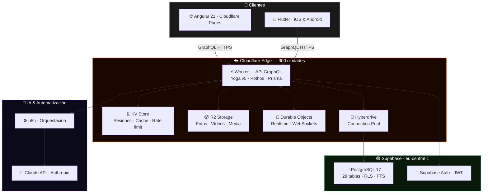

<div align="center">


<br/>

<!-- TYPING SVG -->
<a href="https://savorealo.com">
  
</a>

<br/><br/>

<!-- BADGES -->
<a href="https://savorealo.com">
  
</a>
&nbsp;

&nbsp;

&nbsp;


<br/><br/>


</div>

<br/>

## ¿Qué es Savorealo?

**Savorealo** es la primera red social 100% gastronómica con IA integrada. Los usuarios publican recetas, posts culinarios y reseñas de restaurantes — y si no saben qué cocinar, le dicen a la IA qué ingredientes tienen y en segundos reciben una receta personalizada lista para publicar.

> *No es una app de recetas. Es Instagram para foodies, con un chef con IA en el bolsillo.*

<br/>

<div align="center"></div>

<br/>

## Funcionalidades

<table>
<tr>
<td width="50%">

**Red social**
- 📸 &nbsp;Feed personalizado con posts multimedia
- 👥 &nbsp;Seguir usuarios y restaurantes
- 💬 &nbsp;Comentarios, likes y guardados
- 📖 &nbsp;Stories con expiración 24h
- 💌 &nbsp;Mensajería directa y grupos
- 🔔 &nbsp;Notificaciones en tiempo real

</td>
<td width="50%">

**Gastronomía + IA**
- 🤖 &nbsp;Generador de recetas con Claude AI
- 📷 &nbsp;Sube una foto — la IA identifica ingredientes
- 🌾 &nbsp;Sistema de alergenos y preferencias
- 🗺️ &nbsp;Directorio de restaurantes con reseñas
- 🔍 &nbsp;Búsqueda full-text en español
- 📊 &nbsp;Categorías culinarias y filtros

</td>
</tr>
</table>

<br/>

<div align="center"></div>

<br/>

## Stack tecnológico

<div align="center">

**Frontend & Mobile**

<a href="https://skillicons.dev">
  
</a>

<br/><br/>

**Backend & Infraestructura**

<a href="https://skillicons.dev">
  
</a>

<br/><br/>

**IA, Automatización & DevOps**

<a href="https://skillicons.dev">
  
</a>

</div>

<br/>

<details>
<summary><b>📋 Ver tabla completa del stack</b></summary>
<br/>

| Capa | Tecnología | Versión | Notas |
|---|---|---|---|
| **Framework web** | Angular | 21.x | Signals + Zoneless |
| **UI Components** | PrimeNG + Tailwind CSS | 21.x / v4 | Design system propio |
| **Mobile** | Flutter + Dart | 3.x | iOS y Android |
| **Módulos nativos** | Kotlin | — | Android |
| **API** | GraphQL Yoga v5 | latest | The Guild, spec-compliant |
| **Schema GraphQL** | Pothos | latest | Code-first, type-safe |
| **ORM** | Prisma + Edge | latest | Con Prisma Accelerate |
| **Runtime backend** | Cloudflare Workers | — | Edge serverless, 300 ciudades |
| **Base de datos** | PostgreSQL 17 | via Supabase | 29 tablas, RLS, FTS español |
| **Auth** | Supabase Auth | latest | JWT + OAuth |
| **Media storage** | Cloudflare R2 | — | Sin egress fees |
| **Cache / Sesiones** | Cloudflare KV | — | Edge-distributed |
| **Realtime** | Cloudflare Durable Objects | — | WebSockets persistentes |
| **Connection pool** | Cloudflare Hyperdrive | — | Workers → Supabase |
| **IA generativa** | Claude API (Anthropic) | Sonnet 4 | Generación de recetas |
| **Orquestación IA** | n8n | — | Flujos IA → DB |
| **Lenguaje** | TypeScript 5 strict | 5.x | End-to-end type safety |
| **Testing** | Vitest + Playwright | latest | Unit + E2E |
| **CI/CD** | GitHub Actions | — | Deploy automático |

</details>

<br/>

<div align="center"></div>

<br/>

## Arquitectura



> **Edge-first.** Sin servidores que gestionar. Sin escalado manual. HTTPS automático. Deploy en segundos. Coste estimado MVP: **~5–10 €/mes**.

<br/>

<div align="center"></div>

<br/>

## Base de datos

<div align="center">


&nbsp;

&nbsp;

&nbsp;


</div>

<br/>

<table>
<tr>
<td width="33%" valign="top">

**👤 Usuarios & Social**
```
users
person_profiles
business_profiles
user_settings
follows
```
**🌾 Alergenos & Prefs**
```
allergens
allergen_ingredients
user_allergies
preferences
user_preferences
```

</td>
<td width="33%" valign="top">

**📝 Contenido**
```
posts          ← polimórfico
recipes        ← extensión de post
ingredients
recipe_ingredients
post_media
```
**❤️ Interacciones**
```
likes
comments
saved_posts
viewed_posts
```

</td>
<td width="33%" valign="top">

**💬 Mensajería**
```
conversations
conversation_participants
direct_messages
contacts
```
**🔔 Eventos & IA**
```
notifications
feed_events
places
place_reviews
ai_generations
```

</td>
</tr>
</table>

<details>
<summary><b>🗂️ Ver los 11 dominios con descripción</b></summary>
<br/>

| Dominio | Tablas | Descripción |
|---|---|---|
| 👤 Usuarios | `users`, `person_profiles`, `business_profiles`, `user_settings` | Perfiles persona y negocio separados. `username`, `display_name`, `avatar_url` desnormalizados via trigger |
| 🤝 Grafo social | `follows` | PK compuesta. Triggers actualizan `followers_count` y `following_count` |
| 📝 Contenido | `posts`, `recipes`, `recipe_ingredients`, `ingredients`, `post_media` | Post polimórfico: `PHOTO / VIDEO / TEXT / RECIPE` |
| ❤️ Interacciones | `likes`, `comments`, `saved_posts`, `viewed_posts` | Claves compuestas. Triggers mantienen todos los counters |
| 📖 Stories | `stories`, `viewed_stories` | Campo `expires_at` para expiración automática 24h |
| 💬 Mensajería | `conversations`, `conversation_participants`, `direct_messages` | `type: DIRECT\|GROUP`. Escala a grupos ilimitados |
| 🔔 Notificaciones | `notifications`, `feed_events` | Enum tipado: `LIKE`, `COMMENT`, `FOLLOW`, `MENTION`, `RECIPE_SAVE` |
| 🌾 Alergenos | `allergens`, `allergen_ingredients`, `user_allergies` | 3 capas: alérgeno → ingrediente → usuario |
| 🍽️ Preferencias | `preferences`, `user_preferences` | Culinarias personalizadas |
| 📍 Lugares | `places`, `place_reviews` | `RESTAURANT`, `BAR`, `CAFE`, `BAKERY`, `FOOD_TRUCK` |
| 🤖 IA | `ai_generations` | prompt → resultado JSON → `converted_to_post_id` |

</details>

<br/>

<div align="center"></div>

<br/>

## IA generativa — el diferenciador

<div align="center">

```
┌─────────────────────────────────────────────────────────────────────┐
│                        FLUJO DE GENERACIÓN                          │
├──────────────┬──────────────────────────────┬───────────────────────┤
│   USUARIO    │        SAVOREALO API         │      CLAUDE AI        │
├──────────────┼──────────────────────────────┼───────────────────────┤
│              │                              │                       │
│  Ingredientes│                              │                       │
│  + alergenos │──── prompt estructurado ────►│                       │
│  + prefs     │                              │  genera receta JSON   │
│              │◄─── receta + pasos ──────────│  pasos · tiempos      │
│              │                              │  sustituciones        │
│              │  guarda en ai_generations    │                       │
│◄── preview ──│  status: DONE                │                       │
│              │                              │                       │
│  [publicar]  │                              │                       │
│─────────────►│  crea post tipo RECIPE       │                       │
│              │  en el feed público          │                       │
└──────────────┴──────────────────────────────┴───────────────────────┘
```

</div>

| Flujo | Entrada | Proceso |
|---|---|---|
| **Manual** | Ingredientes + restricciones | Claude genera → usuario revisa → publica |
| **Por foto** | Imagen de ingredientes | Claude Vision identifica → mismo flujo |
| **n8n** | Middleware de orquestación | Reintentos, rate limiting por usuario, métricas |

<br/>

<div align="center"></div>

<br/>

## Flujo de una petición

```
Usuario en Madrid                    Cloudflare Madrid (~80ms total)
       │                                     │
       │──── GraphQL HTTPS ─────────────────►│
       │                                     ├─ 1. Verifica JWT  (0ms, sin DB)
       │                                     ├─ 2. KV cache hit? (<5ms)
       │                                     ├─ 3. Cache miss → Hyperdrive → PG
       │                                     ├─ 4. Cachea KV 30s
       │◄─── respuesta JSON ─────────────────┤
```

<br/>

<div align="center"></div>

<br/>

## Actividad del proyecto

<!-- ═══════════════════════════════════════════════════════════ -->
<!--    GRÁFICO DE ACTIVIDAD — tema naranja Savorealo           -->
<!--    Sustituye savorealo por tu username real de GitHub     -->
<!-- ═══════════════════════════════════════════════════════════ -->
<div align="center">

</div>

<br/>

<div align="center"></div>

<br/>

## CI/CD & Flujo de trabajo

```
┌─────────────────────────────────────────────────────────────────┐
│                        CI/CD PIPELINE                           │
├─────────────────────────────────────────────────────────────────┤
│                                                                 │
│   push → feat/*  ──►  PR review  ──►  merge → develop          │
│                                              │                  │
│                                    GitHub Actions               │
│                              ┌───────────────┼──────────────┐  │
│                              ▼               ▼              ▼  │
│                           Lint +          Angular         Worker│
│                           Tests           Build           Build │
│                          Vitest         CF Pages         wrangler│
│                         Playwright        deploy           deploy│
│                              └───────────────┼──────────────┘  │
│                                              ▼                  │
│                                      Prisma migrate             │
│                                      → Supabase                 │
└─────────────────────────────────────────────────────────────────┘
```

<div align="center">

| Rama | Entorno | Trigger |
|---|---|---|
| `main` | 🔴 Producción | Push automático |
| `develop` | 🟡 Staging | Push automático |
| `feat/*` · `fix/*` | 🟢 Local | Manual |

</div>

Commits con [Conventional Commits](https://www.conventionalcommits.org/) &nbsp;·&nbsp; Commitlint + Husky &nbsp;·&nbsp; PRs máx. 400 líneas

<br/>

<div align="center"></div>

<br/>

## Repositorios

<div align="center">

| Repositorio | Descripción | Stack principal |
|---|---|---|
| [`savorealo-web`](#) | Frontend Angular 21 | Angular · Tailwind · PrimeNG · Apollo |
| [`savorealo-mobile`](#) | App Flutter iOS/Android | Flutter · Dart · Kotlin |
| [`savorealo-api`](#) | Backend GraphQL edge | Workers · Yoga v5 · Pothos · Prisma |
| [`savorealo-infra`](#) | Configuración Cloudflare | Wrangler · IaC |

> 🔒 Repositorios privados — acceso previa solicitud al equipo.

</div>

<br/>

<div align="center"></div>

<br/>

## Desarrollo local

<details>
<summary><b>⚡ Backend — API GraphQL (Cloudflare Workers)</b></summary>
<br/>

```bash
cd savorealo-api
npm install
cp .env.example .env        # rellenar credenciales Supabase + Cloudflare
wrangler dev                # → http://localhost:8787/graphql
```
</details>

<details>
<summary><b>🌐 Frontend web — Angular 21</b></summary>
<br/>

```bash
cd savorealo-web
npm install
cp environments/environment.example.ts environments/environment.ts
ng serve                    # → http://localhost:4200
```
</details>

<details>
<summary><b>📱 Mobile — Flutter</b></summary>
<br/>

```bash
cd savorealo-mobile
flutter pub get
flutter run
```
</details>

<br/>

<div align="center"></div>

<br/>

## Equipo

<div align="center">

<table>
<tr>
  <td align="center" width="50%">
    <br/>
    
    <br/><br/>
    <sub>Angular 21 · API GraphQL · Cloudflare Workers · TypeScript</sub>
    <br/><br/>
  </td>
  <td align="center" width="50%">
    <br/>
    
    <br/><br/>
    <sub>Flutter · Dart · iOS · Android · Kotlin</sub>
    <br/><br/>
  </td>
</tr>
</table>

<br/>


<br/><br/>


<br/>


</div>
